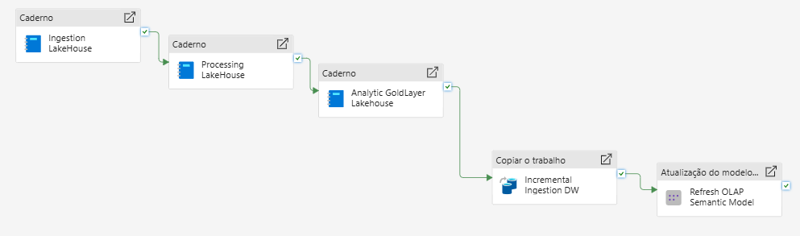

# DataPlatform-Fabric-Caged

Plataforma de dados ponta a ponta construída no para processamento analítico dos microdados mensais do **CAGED**.

A solução utiliza **PySpark, Apache Spark, Delta Lake, Lakehouse, Data Warehouse, Dataflow Gen2, Semantic Model e Power BI**, com foco em processamento incremental, idempotência, qualidade e rastreabilidade.

## Arquitetura

```text
CAGED (.7z/.txt)
      │
      ▼
   BRONZE
      │
      ▼
   SILVER
      │
      ▼
    GOLD
      │
      ├──────────────► Data Warehouse
      │                    ▲
      │                    │
      │             Dataflow Gen2
      │              (Dimensões)
      │
      ▼
Semantic Model
      │
      ▼
   Analytic
```


## Principais componentes

| Camada | Responsabilidade |
|---|---|
| **Bronze** | Ingestão e rastreabilidade dos arquivos originais |
| **Silver** | Tipagem, limpeza, validação e controle de qualidade |
| **Gold** | Regras analíticas, agregações e fato CAGED |
| **Data Warehouse** | Serving analítico com fato + dimensões |
| **Semantic Model** | Camada de consumo para Power BI |
| **Pipeline** | Orquestração ponta a ponta |

## Engenharia aplicada

### Idempotência na ingestão

A Bronze calcula **SHA-256** dos arquivos de origem e utiliza duas barreiras para evitar reprocessamento:

```text
Hash já registrado como SUCCESS no controle
                OU
Hash já existente na Bronze
                ↓
             SKIP
```

Os registros também carregam:

```text
_source_archive
_source_file
_source_file_hash
_ingestion_timestamp
```

### Controle de estado entre camadas

As tabelas de controle não funcionam apenas como logs. Elas participam da lógica de processamento.

```text
Bronze
  ↓
controle de ingestão
  ↓
Silver

Silver SUCCESS
  ↓
LEFT ANTI
  ↓
Gold pendente
```

Assim, competências já processadas não são carregadas novamente.

### Data Quality / Quality Gate

A Silver calcula métricas de qualidade por competência, incluindo:

- conversões de integer, decimal e date;
- `NULL` e percentual de `NULL`;
- valores alterados durante limpeza;
- registros afetados por transformação.

Falhas críticas podem bloquear a carga antes da escrita na Silver.

### Revalidação antes da escrita

Além da validação inicial, a Silver executa uma nova checagem imediatamente antes do `append`.

Isso reduz o risco de duplicidade caso o estado da tabela mude durante a execução.

### Gold com MERGE idempotente

A fato Gold utiliza **Delta Lake `MERGE`** com a granularidade da própria agregação como chave lógica:

```text
competencia_mov
municipio
subclasse
cbo2002ocupacao
sexo
racacor
grau_instrucao
idade
```

Com comparação `null-safe`:

```sql
t.coluna <=> s.coluna
```

Resultado:

```text
match     → UPDATE
não match → INSERT
```

### Regras analíticas

A Gold:

- valida a existência do salário mínimo da competência;
- valida sua unicidade;
- aplica a regra de população salarial válida entre **0,3 e 150 salários mínimos**;
- registra estatísticas e quantidade de registros descartados;
- gera métricas de movimentações, admissões, desligamentos e salários.

## Data Warehouse

A fato `fato_caged` é carregada incrementalmente a partir da Gold.

```text
Lakehouse Gold
      ↓
Copy Job
      ↓
Data Warehouse
```

A carga utiliza `SnapshotPlusIncremental` com `competencia_mov` como coluna incremental.

As dimensões são carregadas separadamente pelo **Dataflow Gen2 `ingestao_dimensoes_caged`**.

Principais dimensões:

```text
dim_uf
dim_mun
dim_cbos
dim_graudeinstrucao
dim_cnaes
dim_idade
dim_sexo
dim_racacor
```

## Orquestração

```text
Ingestion LakeHouse
        ↓
Processing LakeHouse
        ↓
Analytic GoldLayer
        ↓
Incremental Ingestion DW
        ↓
Refresh Semantic Model
```

O pipeline controla dependências entre as etapas e só libera a próxima camada após o sucesso da anterior.



## Estrutura

```text
DataPlatform-Fabric-Caged/
├── Data-Warehouse/
├── Docs/
├── Lakehouse/
│   ├── Bronze/
│   ├── Silver/
│   └── Gold/
├── Notebooks/
│   ├── Ingestion (Bronze)/
│   ├── Processing (Silver)/
│   └── Analytic (Gold)/
├── Pipeline/
├── LICENSE
└── README.md
```

## Stack

**Microsoft Fabric:** Lakehouse, OneLake, Data Pipeline, Dataflow Gen2, Copy Job, Data Warehouse, Semantic Model e Power BI.

**Processamento:** Python, PySpark, Apache Spark e Delta Lake.

## Destaques

```text
Ingestão incremental
+ SHA-256
+ Idempotência
+ Controle de estado
+ Quality Gate
+ Observabilidade
+ Processamento por competência
+ Delta MERGE
+ Data Warehouse
+ Modelagem dimensional
+ Dataflow Gen2
+ Semantic Model
+ Power BI
+ Orquestração Fabric
```

Projeto desenvolvido como referência de arquitetura de engenharia de dados em Microsoft Fabric.
